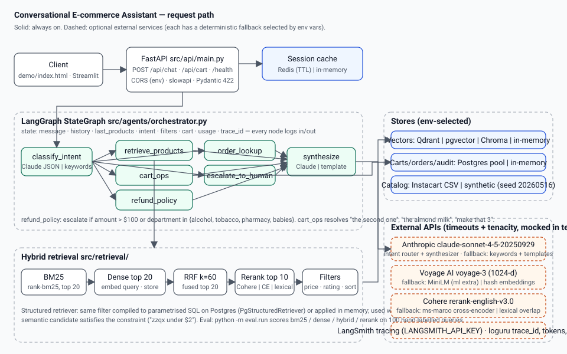

# Architecture — Conversational E-commerce Assistant



## One request, end to end

1. **HTTP** — `POST /api/chat {session_id, user_id, message}` hits FastAPI (`src/api/main.py`).
   Pydantic rejects empty, oversized (> 2000 chars) or malformed bodies with 422; `slowapi`
   rate-limits per client IP; CORS origins come from `CORS_ORIGINS`.
2. **Session** — the API loads `SessionState` (history, products shown in the last search,
   turn counter) from the session cache (`src/session/cache.py`: Redis with TTL, or in-memory).
3. **Graph** — `run_turn` seeds a `ConvState` with a fresh `trace_id` and invokes the compiled
   LangGraph (`src/agents/orchestrator.py`). Every node is wrapped by `node_logger`, so input and
   output state are logged with the trace id and duration.
4. **Response** — `ChatResponse` carries the reply, the intent and confidence, the products
   shown, the cart snapshot, whether the turn was escalated, latency and token/cost accounting.
   The API folds the turn back into the session (`next_session_state`) and stores it.

## The graph

| Node | What it does | LLM path | Deterministic fallback |
|---|---|---|---|
| `classify_intent` | `IntentDecision` (intent, confidence, extracted filters) + `StructuredFilter` parsed from the text | Claude with a strict JSON schema, `timeout=15s`, 3 retries | keyword router (`IntentRouter._heuristic`) |
| `retrieve_products` | hybrid search → rerank → structured filters / sort → top 5 | — | — (retrieval never needs the LLM) |
| `cart_ops` | parse add / remove / update / view / clear, resolve "the second one", "the almond milk", "make that 3" against the previous results, the cart and the catalog; execute through `CartManager` | — | — |
| `refund_policy` | amount from the message, the named product, an order or the cart; departments involved; `evaluate_refund` | — | — |
| `order_lookup` | `#1001` style ids or the user's latest order through `OrderStore` | — | — |
| `escalate_to_human` | flags the turn | — | — |
| `synthesize` | final text with `[pid:N]` citations | Claude, `temperature=0.4` | template that always cites pids and totals |

Node names deliberately differ from state keys (`cart` is a key, `cart_ops` is the node): LangGraph
raises `'cart' is already being used as a state key` otherwise, the bug that blocked three sibling
projects in this portfolio.

## Retrieval stack (`src/retrieval/`)

```
query ─► BM25 (rank-bm25, name+aisle+department, plural folding) ─┐
      └► embed_query ─► DenseStore.search (cosine) ───────────────┴► RRF (k=60) ─► top 20
                                                                       │
                                        Reranker (Cohere | cross-encoder | lexical) ─► top 10
                                                                       │
                       StructuredFilter (price, rating, stock, diet, sort) on lexically related hits
                                                                       │
                             fallback: StructuredRetriever over the whole catalog (SQL or in-memory)
```

* `EmbeddingProvider`: `voyage-3` (paid), `all-MiniLM-L6-v2` (free, `ml` extra, lazy import) or
  `HashEmbeddings` (SHA-1 hashed words + character trigrams, 1024-d). All are 1024-d so
  Qdrant/pgvector schemas do not change when switching.
* `DenseStore`: `QdrantStore`, `PgVectorStore` (psycopg async pool, `<=>` cosine), `ChromaStore`
  (embedded) and `InMemoryDense` (exact cosine). The eval runner benchmarks any of them.
* `Reranker`: `CohereReranker`, `CrossEncoderReranker` (lazy import) or `LexicalReranker`
  (query-token coverage; ties keep the RRF order).
* `StructuredRetriever`: `StructuredFilter` → `build_sql()` (parametrised `%s`, fixed columns) for
  Postgres or `_passes()` in memory. The orchestrator gates sorts by lexical relatedness so
  "cheapest coffee" sorts coffees, not the whole fused list.

## Layers and boundaries

| Layer | Folder | Knows about |
|---|---|---|
| Configuration | `src/config.py` | env vars only (`get_settings()` cached; tests call `cache_clear()`) |
| Domain | `src/agents/`, `src/retrieval/`, `src/session/` | typed inputs/outputs; protocols for every I/O dependency |
| Assembly | `src/agents/runtime.py` | builds indexes, stores, pools, caches from settings |
| Transport | `src/api/` | HTTP, validation, rate limiting; calls `run_turn` only |
| Evaluation | `src/eval/`, `eval/run.py` | reads `data/eval/queries.jsonl`, runs the domain layer, writes `eval/runs/*.json` and `eval/RESULTS.md` |
| Observability | `src/observability.py` | loguru sinks, per-node logging, cost pricing, LangSmith env wiring |

## State and persistence

* **Carts**: `CartManager` protocol. `InMemoryCartManager` (default) or `PgCartManager` over the
  `sessions` / `cart_items` tables (`src/db/init.sql`), one transaction per operation.
* **Sessions**: `SessionCache` protocol. `InMemorySessionCache` (lazy TTL) or `RedisSessionCache`
  (`SET ... EX ttl`, one JSON blob per session).
* **Orders**: `OrderStore` protocol with a deterministic in-memory demo store (three orders) until
  a checkout flow exists.
* **Catalog**: `data/processed/products.csv` from Instacart or the synthetic generator; both share
  the schema in `docs/data_schema.md`.

## Offline mode is a first-class configuration

With no keys, no Docker and no ML extras the process boots with hash embeddings, the lexical
reranker, the keyword router, the template synthesizer, in-memory stores and answers the same
input with the same output every time. That mode is what CI runs, what the static demo was baked
with, and what the red-team project (07) attacks. `GET /health` reports which backend is active
so a reader never mistakes it for the production configuration.
